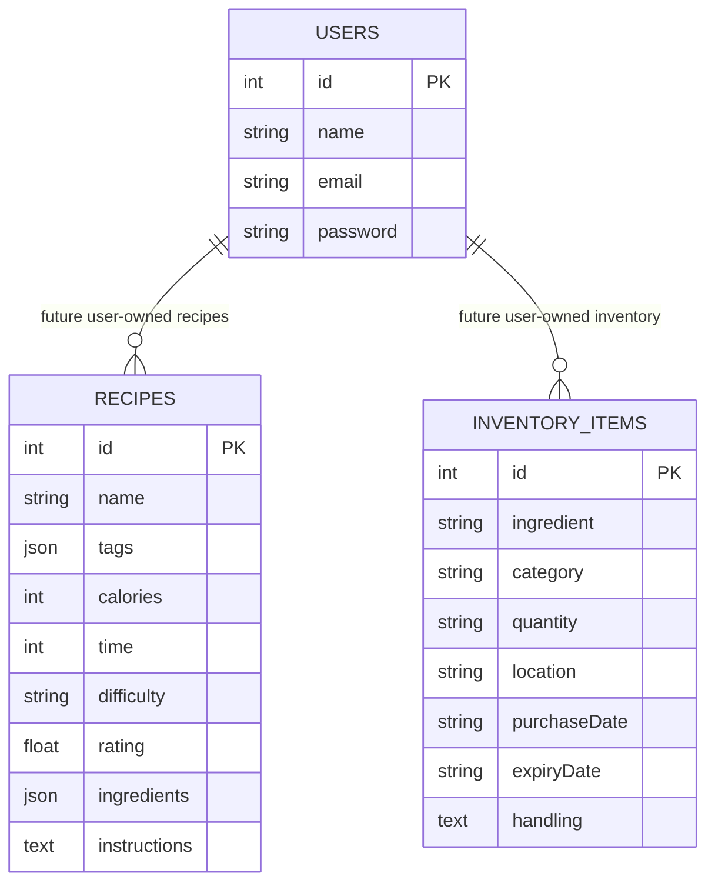

# SmartPantry Database Design

## Overview

SmartPantry uses a PostgreSQL database to store users, recipes, and inventory items. The backend is built with Flask and SQLAlchemy. The database supports recipe CRUD operations, inventory CRUD operations, freshness tracking, auto-expiry calculation, and dashboard summary data.

Database name:

```text
smartpantry_db
```

Database system:

```text
PostgreSQL 16
```

## Tables

SmartPantry currently uses three main tables:

```text
users
recipes
inventory_items
```

---

## Entity Relationship Diagram



Current implementation note:

```text
The current Milestone 2 implementation uses three independent tables without foreign keys.
The ER diagram includes future user-to-recipe and user-to-inventory relationships to show the intended scalable design for a multi-user SmartPantry system.
```

---

## 1. users Table

The users table stores basic user account information for demo authentication.

| Column | Type | Constraint | Description |
|---|---|---|---|
| id | Integer | Primary Key | Unique user ID |
| name | String | Not Null | User name |
| email | String | Unique, Not Null | User email address |
| password | String | Not Null | User password for demo login |

Example seed data:

```text
1 | Liyi Wu | liyi@example.com | password123
```

Note: For a production system, passwords should be hashed instead of stored as plain text.

---

## 2. recipes Table

The recipes table stores recipe information used by the Recipe Library feature.

| Column | Type | Constraint | Description |
|---|---|---|---|
| id | Integer | Primary Key | Unique recipe ID |
| name | String | Not Null | Recipe name |
| tags | JSON | Optional | Recipe tags such as Breakfast, Quick, Vegetarian |
| calories | Integer | Optional | Estimated calories |
| time | Integer | Optional | Estimated cooking time in minutes |
| difficulty | String | Optional | Recipe difficulty |
| rating | Float | Optional | User rating |
| ingredients | JSON | Optional | List of ingredients |
| instructions | Text | Optional | Cooking instructions |

Example seed data:

```text
1 | Avocado Toast | 320 | 15 | Easy | 4.6
2 | One-Pan Veggie Pasta | 450 | 30 | Medium | 4.8
3 | Mango Quinoa Salad | 280 | 20 | Easy | 4.4
```

This table supports:

```text
GET /api/recipes
POST /api/recipes
GET /api/recipes/{id}
PUT /api/recipes/{id}
DELETE /api/recipes/{id}
GET /api/dashboard
POST /api/ai/chat
```

---

## 3. inventory_items Table

The inventory_items table stores pantry and fridge inventory data.

| Column | Type | Constraint | Description |
|---|---|---|---|
| id | Integer | Primary Key | Unique inventory item ID |
| ingredient | String | Not Null | Ingredient name |
| category | String | Optional | Ingredient category |
| quantity | String | Optional | Quantity or amount |
| location | String | Optional | Storage location |
| purchaseDate | String | Optional | Purchase date |
| expiryDate | String | Optional | Expiry date |
| handling | Text | Optional | Storage or handling instructions |

Example seed data:

```text
1 | Baby Spinach | Greens | 1 bag | Fridge | 2026-07-08 | 2026-07-13
2 | Greek Yogurt | Dairy | 2 tubs | Fridge | 2026-07-09 | 2026-07-12
3 | Tomato Sauce | Pantry | 1 jar | Pantry | 2026-05-30 | 2026-06-20
4 | Whole Wheat Bread | Bakery | 1 loaf | Counter | 2026-07-10 | 2026-07-20
5 | Cherry Tomatoes | Vegetables | 1 pint | Fridge | 2026-07-09 | 2026-07-18
6 | Cheddar Cheese | Dairy | 200g | Fridge | 2026-07-05 | 2026-07-25
```

This table supports:

```text
GET /api/inventory
POST /api/inventory
GET /api/inventory/{id}
PUT /api/inventory/{id}
DELETE /api/inventory/{id}
GET /api/dashboard
POST /api/ai/chat
```

---

## Auto-Expiry Rule

SmartPantry includes an auto-expiry rule engine. If the user adds an inventory item without an expiryDate, the backend calculates the expiry date based on the category.

| Category | Shelf Life |
|---|---|
| Greens | 5 days |
| Dairy | 7 days |
| Bakery | 4 days |
| Vegetables | 10 days |
| Meat | 3 days |
| Pantry | 180 days |
| Other | 7 days |

Example:

```text
Ingredient: Eggs
Category: Dairy
Purchase Date: 2026-07-26
Expiry Date Input: blank

Dairy shelf life = 7 days
Auto-calculated expiry date = 2026-08-02
```

---

## Database Implementation Evidence

The PostgreSQL database was created successfully.

Database tables:

```text
inventory_items
recipes
users
```

Seed data was inserted successfully:

```text
recipes: 3 rows
inventory_items: 6 rows
users: 1 row
```

---

## Database Integration

The backend uses SQLAlchemy models to connect Flask routes to PostgreSQL tables.

The major models are:

```text
User
Recipe
InventoryItem
```

The application creates database tables when the backend starts:

```python
with app.app_context():
    db.create_all()
    seed_data()
```

This confirms that the backend API is integrated with the PostgreSQL database instead of using only in-memory Python lists.

---

## Future Database Improvements

Future versions can add explicit foreign keys and relationship tables, such as:

```text
users.id -> recipes.user_id
users.id -> inventory_items.user_id
recipes.id -> recipe_ingredients.recipe_id
inventory_items.id -> inventory_usage_logs.inventory_item_id
```

These additions would make the database design more scalable for multiple users and more detailed recipe-to-inventory matching.